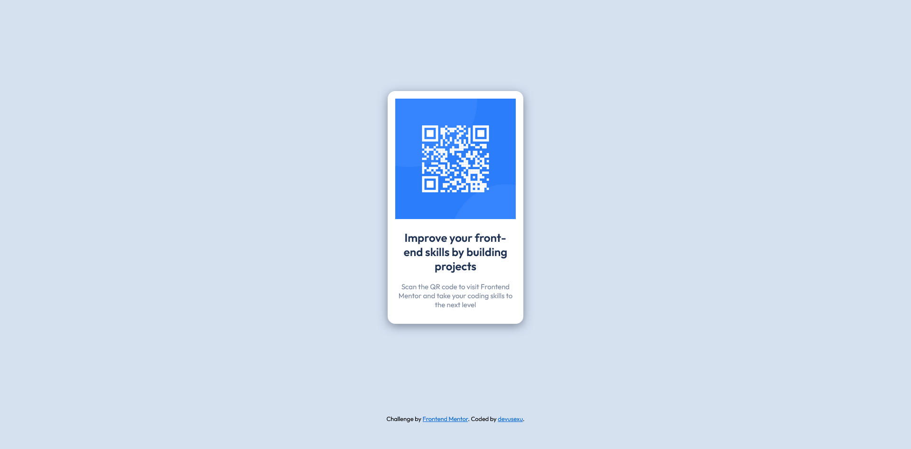

# Frontend Mentor - QR code component solution

This is a solution to the [QR code component challenge on Frontend Mentor](https://www.frontendmentor.io/challenges/qr-code-component-iux_sIO_H). Frontend Mentor challenges help you improve your coding skills by building realistic projects. 

## Table of contents

- [Overview](#overview)
  - [Screenshot](#screenshot)
  - [Links](#links)
- [My process](#my-process)
  - [Built with](#built-with)
  - [What I learned](#what-i-learned)
  - [Continued development](#continued-development)
  - [Useful resources](#useful-resources)

## Overview

### Screenshot

### Links

- [Solution URL](https://github.com/devusexu/qr-code)
- [Live Site URL](https://devusexu.github.io/qr-code/)

## My process
### Built with

- Semantic HTML5 markup
- CSS custom properties
- Mobile-first workflow

### What I learned

During the process, I learned that I need to start doing tons of challenges and projects.  
I realized that hundreds of tutorials/videos/articles can only give me nothing without building anything on my own.  
I estimated 35 mins for this newbie challenge, but I ended up spending almost 6 hours on this.  
I was disappointed and frustrated, but I knew this is what I should feel to be better. 

### Continued development

HTML
- Use better semantic element

CSS
- Organize CSS 
- Replace hard-coded margin top/bottom value(i.e. 12em)
- Try flexbox
- Select better color for link hover and active state

And the main element would become too small when resizing the window, better solution is needed.

### Useful resources

- [Drop shadow](https://developer.mozilla.org/en-US/docs/Web/CSS/filter-function/drop-shadow) - Nice effect. 

